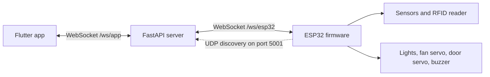

# SmartHome

A local smart-home prototype that connects a Flutter control app, a FastAPI server, and ESP32 firmware for device control and sensor updates over a home network.

[](LICENSE)

## Overview

SmartHome is a three-part IoT project:

- **Flutter app** for manual device control, Vietnamese voice commands, and sensor readings.
- **FastAPI server** that relays messages between the app and ESP32, exposes a health endpoint, and stores incoming logs and sensor records as JSON Lines files.
- **ESP32 firmware** that connects to Wi-Fi, reports sensor data, controls configured outputs, and runs local automation.

This repository is a prototype, not a production-hardened home automation platform. See [Limitations and security](#limitations-and-security) before connecting it to an untrusted network.

## Features

### Flutter app

- Manual on/off control for the configured lights and fan.
- Vietnamese voice-command input through the platform speech-recognition plugin (`vi_VN`).
- Live sensor readings and recent sensor records received from the server.
- WebSocket communication with the server, including reconnect attempts.

### Server

- WebSocket endpoints for the app (`/ws/app`) and ESP32 (`/ws/esp32`).
- Forwards app device commands to the connected ESP32 and returns acknowledgements to the app.
- Broadcasts incoming sensor and log records to connected app clients.
- Appends server-received logs and sensor records to JSONL files in `server/`.
- UDP discovery responder for ESP32 clients on the local network.
- `GET /health` endpoint.

### ESP32 firmware

- Reports motion, light, gas, temperature, humidity, and buzzer state.
- Includes automatic behavior for configured devices, a door servo, buzzer alerts, and RFID-related logic.
- Uses Wi-Fi credentials saved in ESP32 NVS when available, attempts fallback credentials otherwise, and starts a setup access point if it cannot connect.
- Attempts UDP server discovery before using its configured server fallback.

## Architecture



The app sends commands to the server; it does not connect directly to the ESP32. The server currently holds one ESP32 WebSocket connection and can serve multiple app WebSocket clients.

## Requirements

- **Python:** a Python installation compatible with the packages in `server/requirements.txt`. The repository does not declare a minimum Python version.
- **Flutter:** Flutter and Dart satisfying the SDK constraint in [`smarthomeapp/pubspec.yaml`](smarthomeapp/pubspec.yaml) (`^3.11.5`).
- **Firmware:** an ESP32-compatible Arduino toolchain and the libraries required by the firmware includes: WebSocketsClient, ArduinoJson, ESP32Servo, DHT, and MFRC522. The exact board model and library versions are not specified in this repository.
- A Wi-Fi network reachable by both the server host and ESP32. UDP discovery requires LAN broadcast traffic to be allowed.

## Quick Start

### 1. Start the server

From the repository root, create a virtual environment and install the declared dependencies.

**Windows PowerShell:**

```powershell
cd server
python -m venv .venv
.\.venv\Scripts\Activate.ps1
python -m pip install -r requirements.txt
python main.py
```

**macOS/Linux:**

```bash
cd server
python3 -m venv .venv
source .venv/bin/activate
python -m pip install -r requirements.txt
python main.py
```

The server listens on port `5000` by default and starts its UDP discovery responder on port `5001`. Check the health endpoint at <http://localhost:5000/health>.

### 2. Run the Flutter app

In a second terminal, from the repository root:

```bash
cd smarthomeapp
flutter pub get
flutter run -d chrome
```

The web app uses the browser's current host with port `5000`. For non-web targets, the app currently uses a private-LAN fallback host defined in [`app_config.dart`](smarthomeapp/lib/config/app_config.dart); update that value for your network before running on a phone or another non-web target.

### 3. Flash the ESP32

1. Open [`esp32_client.ino`](esp32_client/esp32_client.ino) in an Arduino-compatible IDE and select an appropriate ESP32 board and serial port. The repository does not specify a tested board model.
2. Install the libraries required by the sketch, including WebSocketsClient, ArduinoJson, ESP32Servo, DHT, and MFRC522.
3. Review the Wi-Fi fallback credentials and server fallback in the sketch. Replace any credentials with your own private values; never publish real credentials. Do not copy credentials from the source into documentation or issue reports.
4. Start the server before powering up the ESP32. Open Serial Monitor at `115200` baud to observe connection and discovery messages.
5. If Wi-Fi connection fails, the firmware starts an access point named `ESP32-Setup`; connect to it and use the setup page at the IP printed to Serial Monitor to save Wi-Fi credentials. The access point is currently created without a password, so perform setup only in a controlled environment.

After joining Wi-Fi, the firmware broadcasts a UDP discovery request on port `5001`. If it receives no response, it falls back to its configured server host, port, and WebSocket path. Make sure the server host firewall permits the required TCP and UDP traffic on your LAN.

## Usage

The app and server exchange JSON messages over `/ws/app`. For example, the app can request that the server turn on the living-room light:

```json
{
  "action": "set_state",
  "deviceId": "lamp-1",
  "isOn": true,
  "requestId": "example-request"
}
```

The server forwards the device command to the ESP32 over `/ws/esp32`:

```json
{
  "action": "set_state",
  "deviceId": "lamp-1",
  "isOn": true
}
```

The ESP32 sends sensor readings and log events to the server, which broadcasts them to connected app clients. The app's voice-control tab recognizes Vietnamese speech and maps configured phrases to device commands; recognition availability depends on the target platform and its speech-recognition services.

## Configuration

| Component | Setting | Default or behavior | Notes |
| --- | --- | --- | --- |
| Server | `FASTAPI_PORT` | `5000` | Environment variable for the HTTP/WebSocket server port. |
| Server | `DISCOVERY_PORT` | `5001` | Environment variable for UDP discovery; the ESP32 sketch currently broadcasts on port `5001`. |
| Flutter | `serverPort` | `5000` | Constant in `smarthomeapp/lib/config/app_config.dart`. |
| Flutter web | Server host | Current browser host, or `localhost` if empty | Used to build the app's server URL. |
| Flutter non-web | `fallbackLanHost` | `10.152.235.10` | Hardcoded private-LAN address; change it in `app_config.dart` for your network. |
| ESP32 | Wi-Fi credentials | Saved values in NVS take precedence; otherwise sketch fallback values are used | Credential defaults are intentionally not reproduced here. Replace any real values in the sketch and do not commit secrets. |
| ESP32 | Server host, port, path | Hardcoded host fallback, `5000`, `/ws/esp32` | UDP discovery may replace these values at startup. Change the fallback host if needed. |

The firmware GPIO mapping is defined in the sketch. It is not a verified wiring diagram; check each component's electrical requirements and your exact board before connecting hardware.

| Function | GPIO |
| --- | ---: |
| Living-room light | 21 |
| Bedroom 1 light | 25 |
| Bedroom 2 light | 27 |
| Fan servo | 17 |
| Buzzer | 15 |
| PIR motion sensor | 4 |
| Light sensor | 34 |
| DHT sensor | 14 |
| Door servo | 26 |
| Gas sensor | 35 |
| MFRC522 RFID: SS / RST / SCK / MISO / MOSI | 5 / 22 / 18 / 19 / 23 |

## Development and Testing

Run the Flutter widget test from the app directory:

```bash
cd smarthomeapp
flutter test
```

The repository currently contains a widget smoke test for the app shell. No server integration test or hardware-in-the-loop test suite was found, so this command does not verify the backend, network connections, or physical hardware.

The main source locations are:

```text
server/                 FastAPI server and Python dependencies
smarthomeapp/lib/       Flutter application source
smarthomeapp/test/      Flutter widget tests
esp32_client/           ESP32 firmware and simulator
docs/                    Architecture and technical notes
```

## Documentation

The technical documents below are primarily written in Vietnamese:

- [System architecture](docs/01_architecture.md)
- [Flutter client notes](docs/02_flutter_client.md)
- [Server notes](docs/03_server.md)
- [ESP32 hardware and firmware notes](docs/04_esp32_hardware.md)
- [Data format and security notes](docs/05_data_security.md)

Treat these reports as supporting documentation and verify implementation details against source code; some statements describe recommendations or may be outdated.

## Limitations and Security

> [!WARNING]
> This project is intended for controlled local-network experimentation. Do not expose it directly to the public Internet.

- WebSocket connections use `ws://`; the server does not authenticate WebSocket clients or provide TLS.
- The server allows requests from all CORS origins; this is not an authentication or access-control mechanism.
- The server supports one ESP32 WebSocket client at a time. Its WebSocket connections and client lists are kept in memory.
- The ESP32 setup access point is created without a password, and the firmware contains fallback Wi-Fi credentials in source. Replace any real credentials and restrict physical access during setup.
- UDP discovery depends on local broadcast traffic and may be blocked by host firewalls, VLANs, or Wi-Fi client isolation.
- Voice recognition depends on platform support and installed speech-recognition services; it is not guaranteed to work on every emulator or browser.
- The configured GPIO numbers and control logic are not a substitute for component datasheets, electrical isolation, or hardware safety review.

TLS, client authentication, hardened setup provisioning, and multi-device server support are not implemented in the current code.

## License

This project is distributed under the MIT License. See [LICENSE](LICENSE).
